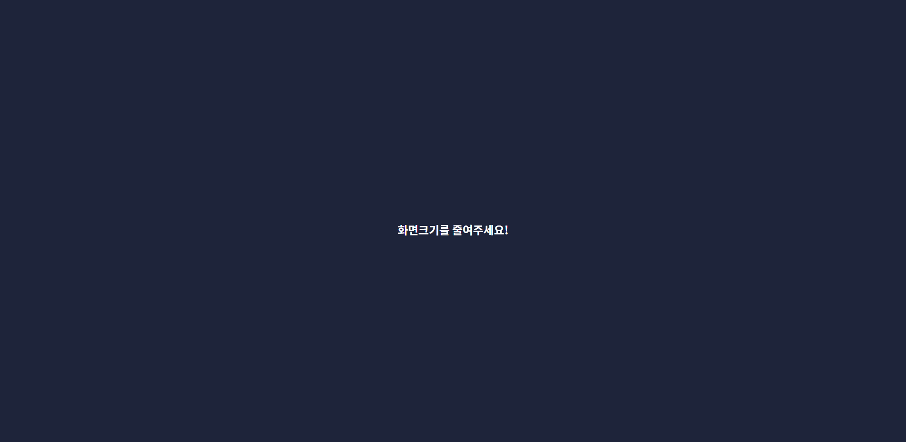
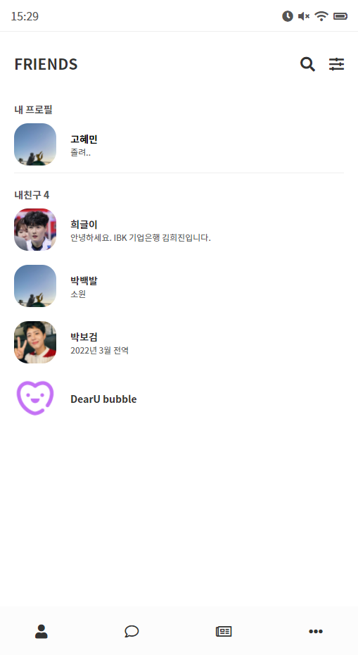
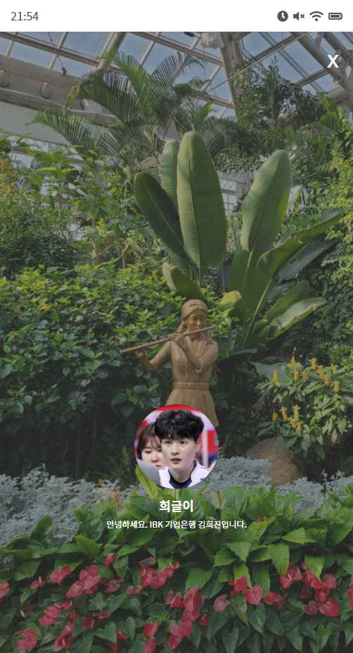
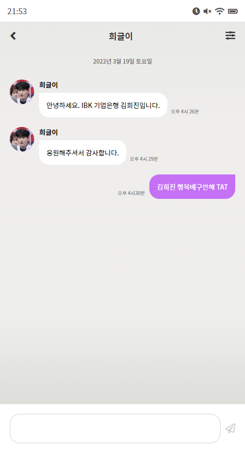
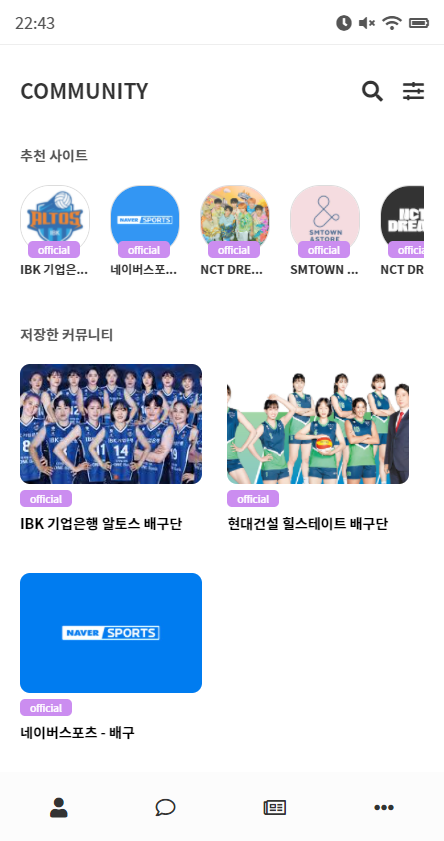
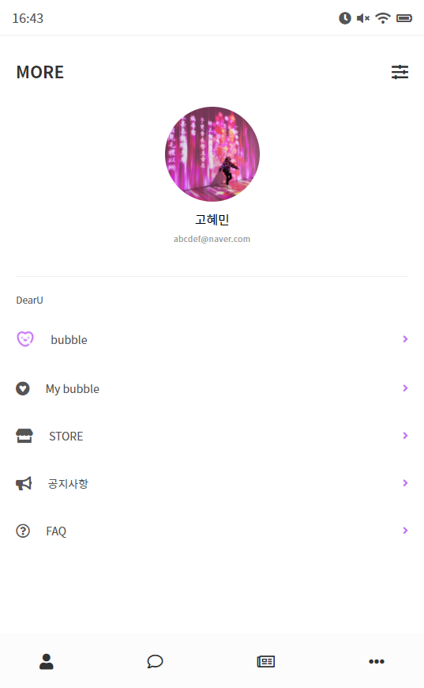

# [React] Bubble 클론 코딩

[](https://wizardly-hermann-7fecb3.netlify.app)

이미지를 클릭하면 사이트로 이동합니다.

<br>
<br>
<hr>

## #About

<br>
1 react   <br> 
2 react-router-dom  <br> 
3 react-live-clock  <br> 
4 sasss  <br> 
<br> 
React를 사용하여 Lysn Bubble 어플을 클론 코딩하였다. 프로필 화면에 있는 이미지를 클릭하면, 해당 친구의 프로필 이미지를 크게 확인할 수 있으며 채팅방에 들어가서 친구에게 메세지를 보낼 수 있다.
<br>
<br>
<hr>

## #추가되어야하는 기능

<br>
1 친구가 보낸 메세지와 내가 보낸 메세지를 정렬하여 채팅방 화면에 출력하기<br>
2 마지막으로 전송 or 받은 메세지 미리보기 화면에 띄우기

<br>
<br>
<hr>

## #route 구성

<br>

oversize : 550px 이상일 경우 화면 축소 안내 화면<br>
<br>
<br>

profile : 메인페이지, 내 프로필과 친구들 목록<br>
<br>
<br>

profile detail: 친구들 프로필 이미지를 클릭하였을 때 출력되는 화면<br>
<br>
<br>

chat : 채팅방 목록<br>
<br>
<br>


chatting : 채팅방, 친구와 주고받은 메세지를 확인할 수 있음<br>
<br>
<br>


community : 추천 커뮤니티와 사이트를 확인 할 수 있음<br>
<br>
<br>

setting: 어플 설정 페이지 
<br>
<br>
<hr>

## #react-live-clock 라이브러리로 실시간 시계 만들기

<br>

https://momentjs.com/docs/#/displaying/format/

| 설치

```
npm install --save react-live-clock
```

| 사용

```js
import Clock from "react-live-clock";

<Clock format="HH:mm" ticking={true} />;
// ticking: 실시간 새로고침
```
